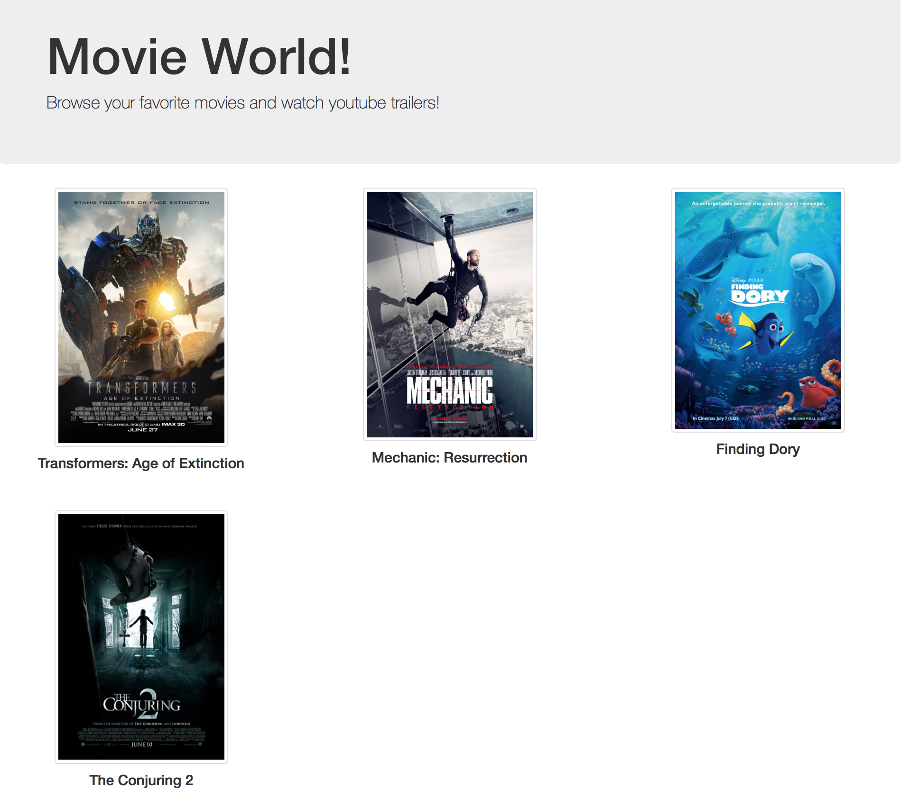
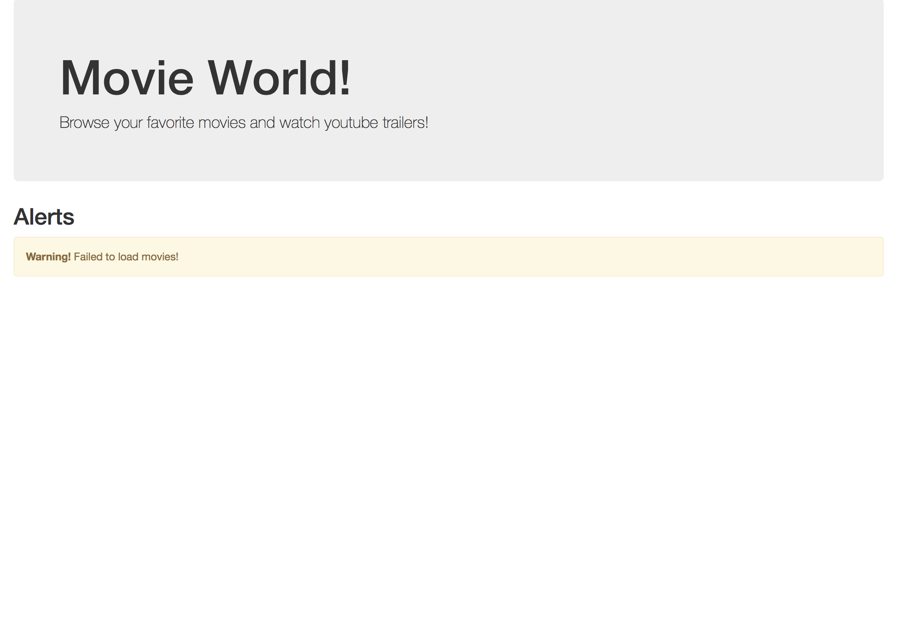

## Introduction

Movie Trailer Website is my first project from **Full Stack Web Developer Nanodegree** program. It focuses on writing server-side code to store a list of your favorite movies, including box art imagery and a movie trailer URL. It generates a static web page allowing visitors to browse their movies and watch the trailers.

## Requirements

* python >= 2.7
* web browser: any recent stable release of Safari/Chrome/Firefox

## Usage

Run `entertainment_center.py`:

* `python <path>/entertainment_center.py`
* To add more movies, update 'movies.json'. If there is any erro in 'movies.json' then error will be shown on html page.

## Details

* `entertainment_center.py` module creates the list of movie objects by reading movie details from `movies.json` file.
* It passes this list to `open_movies_page()` function.
* `open_movies_page()` generates a static web page with the movie title, poster images and youtube URL for each movie in the list.
* Movie class defined in `media.py` module and contains only one constructor which creates and initialize movie object with a title, poster image URL, trailer youtube URL and along with other movie details.
*  User can click on movie poster image to see it's youtube trailer.

## Demo

Error while loading movies:

